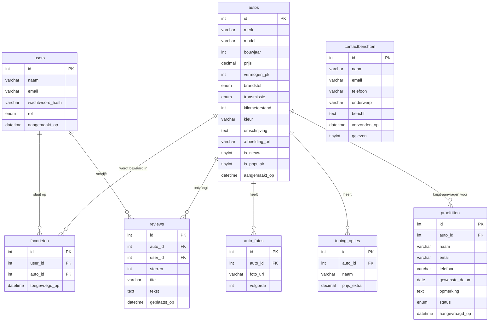

# ERD – AutoHub Database

Het volledige databasemodel van AutoHub, gegenereerd vanuit `database/schema.sql`.

Het PDF-bestand van het ERD staat ook in deze map: [ERD_AutoHub.pdf](./ERD_AutoHub.pdf)

---

---

## Toelichting relaties

| Relatie | Type | Uitleg |
|---|---|---|
| `autos` → `auto_fotos` | 1 op n | Een auto kan meerdere galerij-foto's hebben |
| `autos` → `tuning_opties` | 1 op n | Een auto kan meerdere configuratie-opties hebben |
| `users` → `favorieten` | 1 op n | Een gebruiker kan meerdere auto's opslaan |
| `autos` → `favorieten` | 1 op n | Een auto kan door meerdere gebruikers worden opgeslagen |
| `users` → `reviews` | 1 op n | Een gebruiker kan meerdere reviews schrijven |
| `autos` → `reviews` | 1 op n | Een auto kan meerdere reviews ontvangen |
| `autos` → `proefritten` | 1 op n | Per auto kunnen meerdere proefritten worden aangevraagd |
| `contactberichten` | onafhankelijk | Staat los van users (ook bezoekers kunnen contact opnemen) |
